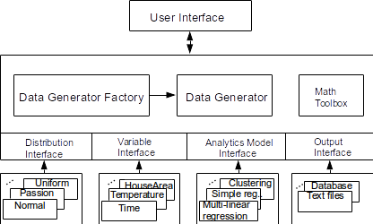

Smart Meter Data Generator (Standalone version)
======================
This data generator is a framework that could generate the data for different analytic purpose. It is an standalone version deployed on a single server. For the cluster version that runs on Spark, please refer to 
The following figure shows the architecture of the data generator. The kernel is the generator factory, which is responsible for creating the generator that satisfies a specific data model. This generator currently supports generating the following data sets:

* Simple linear regression data
* Multiple linear regression data
* Clustering data
* Smart meter data (satisfying 3-line model with seeded data)

Compile & Usage
=====================
**Compile:** mvn package

**Usage:** java org.iss4e.datagen.DataGenMain --help
